# Итоговая документация проекта Listly

## 1. Понятный итоговый результат

**Тип проекта:** прикладной Android-проект.

**Итоговый результат:** рабочий Android-клиент `Listly`, который позволяет пользователю авторизоваться, искать медиаконтент, добавлять позиции в личный readlist, распределять их по папкам, фильтровать и сортировать readlist, а также управлять темой приложения и папками.

**Scope, который считается завершенным к защите:**

| Блок | Статус | Что входит |
| --- | --- | --- |
| Авторизация | Реализовано | Вход, регистрация, сохранение JWT-токена, выход из аккаунта |
| Каталог | Реализовано | Поиск через backend, фильтр по типу, карточки медиапозиций |
| Readlist | Реализовано | Получение пользовательской коллекции, фильтр по типу, фильтр по папке, сортировка |
| Папки | Реализовано | Создание, выбор, переименование и удаление папок |
| Детальный экран | Реализовано | Просмотр выбранной медиапозиции, добавление/удаление из readlist |
| Настройки | Реализовано | Смена светлой/темной темы, авторизация из настроек, выход |
| Автотесты | Частично реализовано | Есть unit-тесты для auth-input и политики auth-навигации; расширенный тест-план описан ниже |

**Границы проекта:**

- Клиент использует существующий backend и не включает серверную реализацию.
- В приложении нет полноценного offline-first режима: данные readlist и каталога загружаются с backend.
- Retrofit подключен как инфраструктурная зависимость, но текущие запросы выполняются через OkHttp.
- Авторизация сделана на локальном Compose-state, основные фичи построены через ELM/Elmslie.
- Расширенный набор автотестов описан как план качества; не все проверки уже оформлены в коде.

## 2. Репозиторий и воспроизводимость

**Репозиторий:** https://github.com/Slaptor69/ListLyApp

**Upstream-репозиторий:** https://github.com/MisterPotz/Elmslie-Demo

**Фиксирующий коммит локальной версии:** `23c4705 final folder screen+ readlist soting`

Для защиты можно дополнительно создать тег:

```powershell
git tag defense-v1
git push origin defense-v1
```

### Инструкция запуска

Требования:

- Android Studio;
- JDK 17;
- Android SDK с `compileSdk 36`;
- доступ к backend `http://158.160.251.150:8080` или совместимому локальному backend.

Команды:

```powershell
.\gradlew.bat assembleDebug
.\gradlew.bat testDebugUnitTest
```

### Проверка качества

Минимальная проверка качества перед показом:

1. Сборка debug APK командой `.\gradlew.bat assembleDebug`.
2. Unit-тесты командой `.\gradlew.bat testDebugUnitTest`.
3. Ручной end-to-end сценарий из раздела 6.
4. Проверка backend-доступности: приложение должно получать ответы от `/auth/login`, `/auth/register`, `/media/search`, `/folders`, `/user-media`.

## 3. Краткое описание проекта

`Listly` - мобильное приложение для ведения личного списка медиаконтента. Пользователь может найти фильм, сериал, аниме или игру, добавить позицию в readlist, назначить папку и затем просматривать свою коллекцию с фильтрами и сортировкой.

Технически проект построен как Android-клиент на Kotlin и Jetpack Compose. Для экранов каталога, readlist, деталей и настроек используется ELM-подход через библиотеку Elmslie: UI отправляет события, reducer изменяет состояние и выдает команды, actor выполняет асинхронную работу через repository/interactor и возвращает внутренние события.

## 4. Архитектурные и логические схемы

### Схема 1. Общая архитектура Android-клиента

Эта схема показывает основные слои приложения и направление зависимостей: UI работает со Store, Store запускает бизнес-операции через Actor, а доступ к backend и локальному хранилищу изолирован в repository.

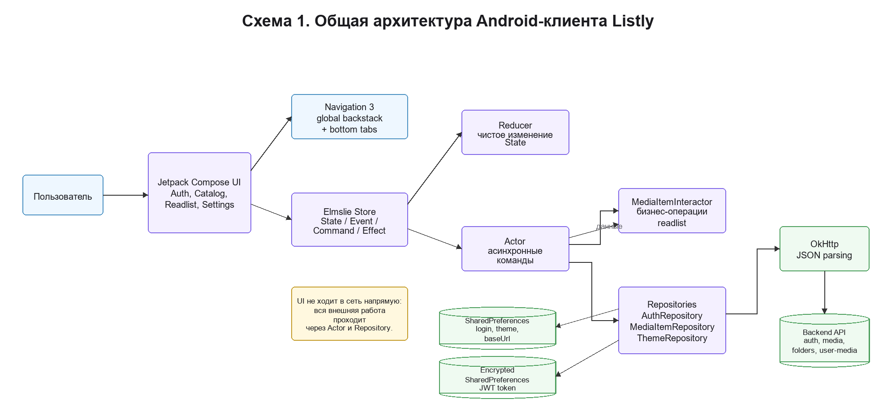

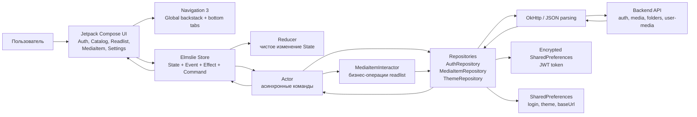

### Схема 2. Навигация приложения

Эта схема описывает пользовательские переходы: после запуска приложение выбирает между auth-экраном и главным контейнером с нижней навигацией.

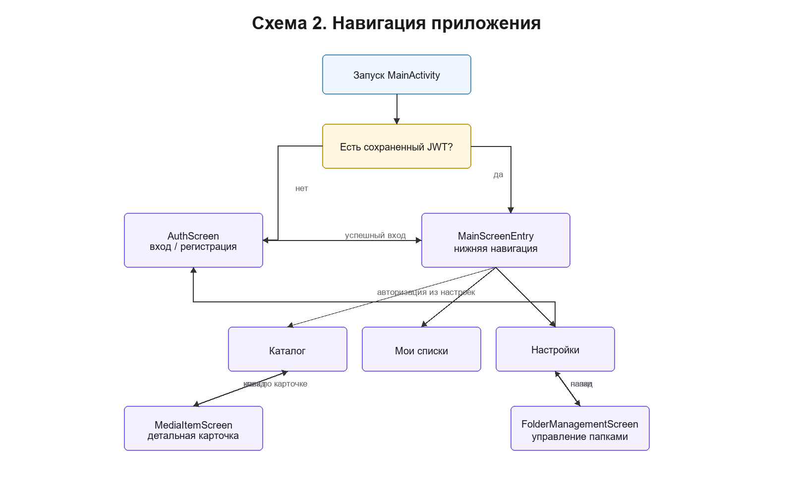

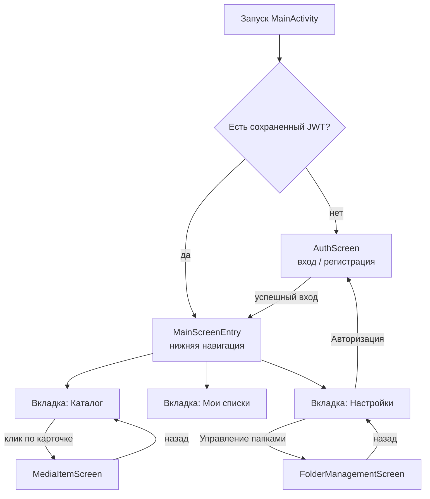

### Схема 3. ELM-цикл экрана

Эта схема показывает, как устроены основные фичи `Catalog`, `Readlist`, `MediaItem` и `Settings`.

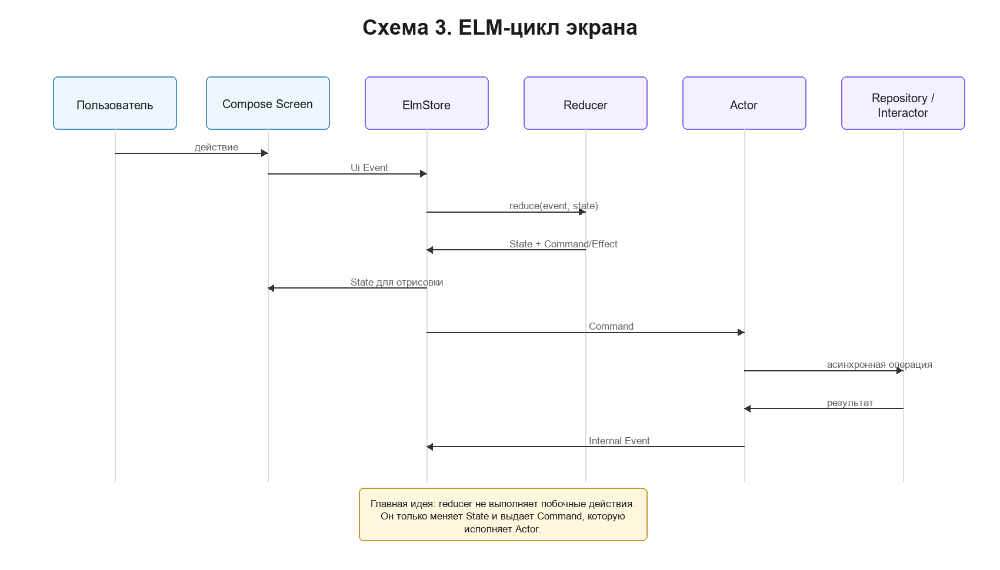

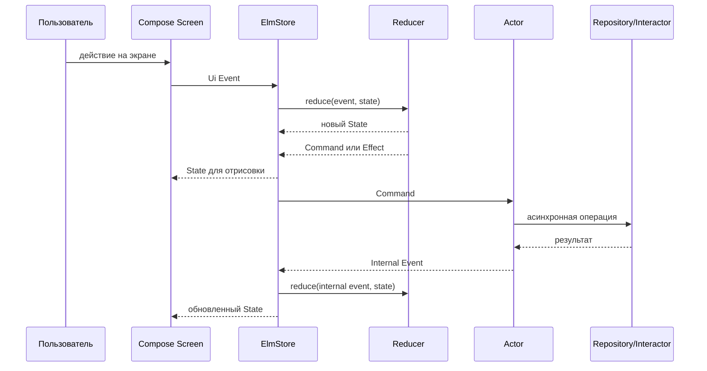

### Схема 4. Поток данных при добавлении медиапозиции в readlist

Эта схема описывает ключевой end-to-end сценарий: пользователь выбирает папку в каталоге, приложение отправляет данные на backend и обновляет UI.

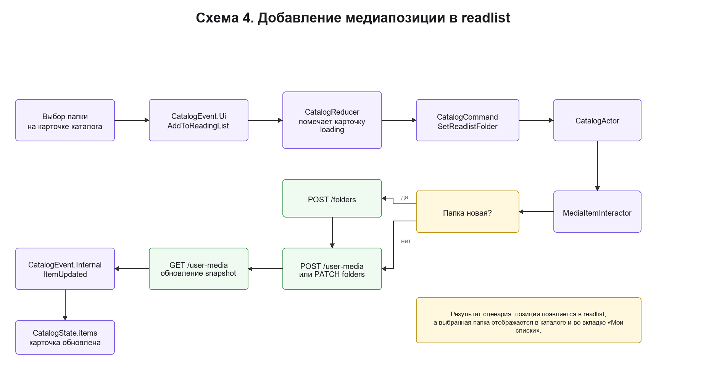

```mermaid
flowchart LR
    Click["Пользователь выбирает папку<br/>на карточке каталога"] --> Event["CatalogEvent.Ui.AddToReadingList"]
    Event --> Reducer["CatalogReducer<br/>помечает карточку loading"]
    Reducer --> Command["CatalogCommand.SetReadlistFolder"]
    Command --> Actor["CatalogActor"]
    Actor --> Interactor["MediaItemInteractor.setMediaItemReadlistFolder"]
    Interactor --> FolderCheck{"Папка новая?"}
    FolderCheck -- "да" --> CreateFolder["POST /folders"]
    FolderCheck -- "нет" --> UserMedia["PATCH /user-media/{id}/folders<br/>или POST /user-media"]
    CreateFolder --> UserMedia
    UserMedia --> Fetch["GET /user-media<br/>обновление локального snapshot"]
    Fetch --> Internal["CatalogEvent.Internal.ItemUpdated"]
    Internal --> State["CatalogState.items<br/>карточка обновлена"]
```

### Схема 5. Интеграция с backend

Эта схема подписывает внешние API-точки, которые использует Android-клиент.

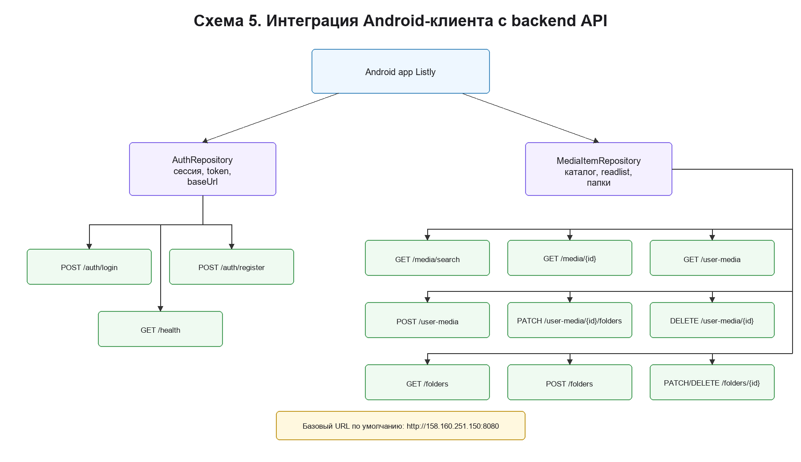

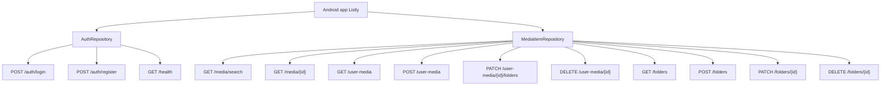

### Схема 6. Доменная модель

Эта схема показывает основные сущности, с которыми работает клиент.

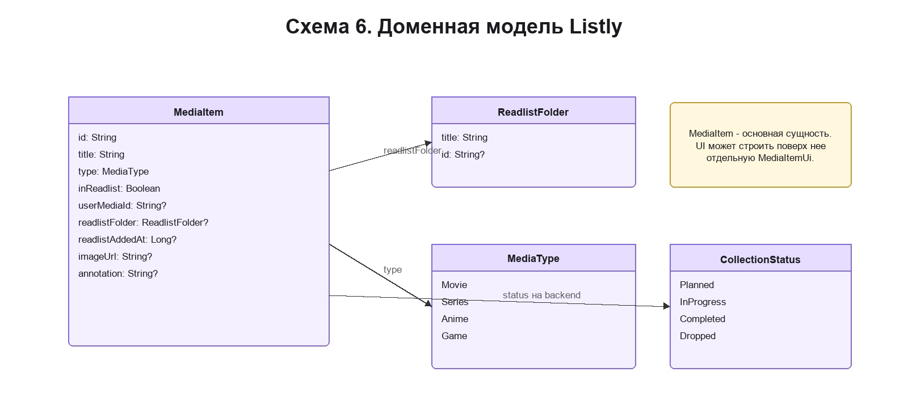

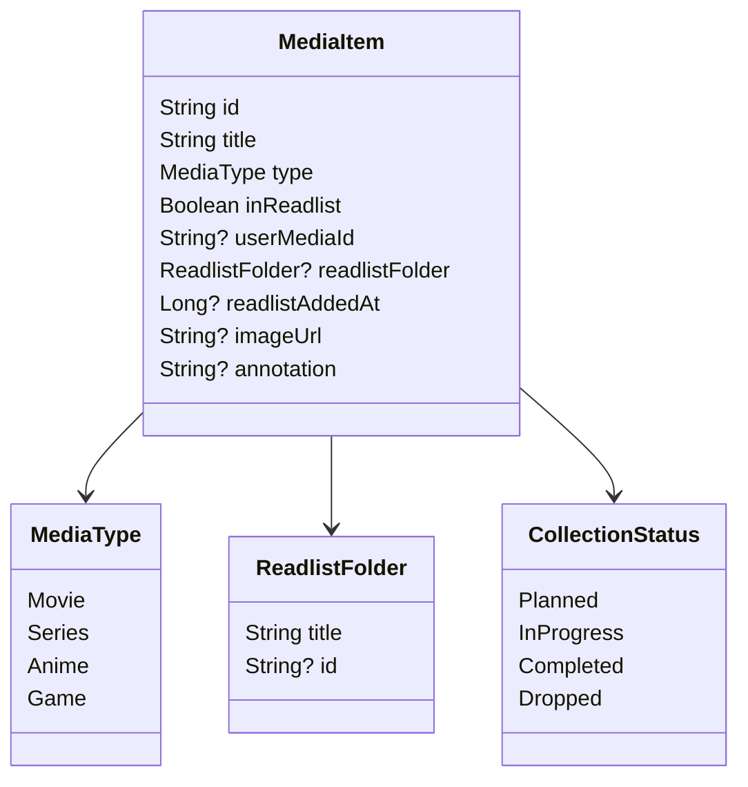

## 5. Реализованные требования и функции

| Требование / функция | Реализация в коде |
| --- | --- |
| Стартовая авторизация | `MainActivity`, `AuthRepository`, `AuthScreen` |
| Регистрация и логин | `AuthRepository.register`, `AuthRepository.login`, `AuthRepository.registerAndLogin` |
| Хранение сессии | `Encrypted SharedPreferences` для JWT-токена, `SharedPreferences` для login/theme/baseUrl |
| Каталог медиапозиций | `CatalogScreen`, `CatalogStore`, `MediaItemRepository.searchCatalog` |
| Фильтрация каталога по типу | `CatalogTypeFilter` в `CatalogScreen` |
| Детальный экран | `MediaItemScreen`, `MediaItemStore` |
| Добавление в readlist | `MediaItemInteractor`, `MediaItemRepository.addMediaToReadlist` |
| Удаление из readlist | `MediaItemRepository.removeMediaFromReadlist` |
| Выбор папки | `CatalogReadlistFolderButton`, `updateReadlistFolder` |
| Readlist | `ReadlistScreen`, `ReadlistStore`, `refreshReadlist` |
| Фильтрация readlist | `ReadlistFilter`, `ReadlistFolderFilter` |
| Сортировка readlist | `ReadlistSort` |
| Управление папками | `FolderManagementScreen`, `CreateFolderControls` |
| Смена темы | `SettingsScreen`, `SettingsStore`, `ThemeRepository` |
| Навигация между разделами | `MainActivity`, `MainScreenEntry`, `AuthNavigationPolicy` |
| DI | `AppModule`, `AppComponent`, `MyApplication` |

## 6. End-to-end сценарий для демонстрации

**Цель сценария:** показать, что приложение выполняет полный пользовательский путь от входа до управления readlist.

1. Открыть приложение.
2. Если пользователь не авторизован, зарегистрироваться или войти.
3. Попасть на главный экран с нижней навигацией.
4. На вкладке `Каталог` выполнить поиск, например по названию фильма или сериала.
5. Отфильтровать результаты по типу: фильмы, сериалы, аниме или игры.
6. На карточке выбранной медиапозиции открыть меню папок.
7. Создать новую папку или выбрать существующую.
8. Убедиться, что позиция помечена как добавленная в readlist.
9. Перейти на вкладку `Мои списки`.
10. Проверить, что медиапозиция появилась в списке.
11. Применить фильтр по типу, фильтр по папке и сортировку.
12. Открыть вкладку `Настройки`.
13. Сменить тему приложения.
14. Открыть `Управление папками`, переименовать тестовую папку.
15. Вернуться назад и выйти из аккаунта.

## 7. Проверки качества и тестирование

### Реализованные unit-тесты

| Тестовый файл | Что проверяет |
| --- | --- |
| `AuthInputPreparationTest.kt` | Тримминг логина/пароля, ошибка при пустом логине, ошибка при пустом пароле |
| `AuthNavigationPolicyTest.kt` | Открытие auth из настроек, возврат в настройки после auth, fallback для неожиданного backstack |
| `ExampleUnitTest.kt` | Шаблонный smoke-тест Gradle/JUnit |

### Расширенный тест-план к защите

Этот раздел фиксирует максимальный набор проверок, который стоит держать как чек-лист качества. Часть пунктов уже реализована в unit-тестах, часть описывает недостающие автотесты и ручные проверки.

| Уровень | Проверка | Ожидаемый результат |
| --- | --- | --- |
| Unit | `prepareAuthInput` обрезает пробелы | В Store/Repository уходит нормализованный логин и пароль |
| Unit | `prepareAuthInput` отклоняет пустые значения | UI получает понятную ошибку |
| Unit | `backstackForOpeningAuthFromSettings` | Auth открывается поверх Settings |
| Unit | `backstackForClosingAuth` | Закрытие auth возвращает пользователя в Settings или Main |
| Unit | `CatalogReducer.SearchChanged` | State переходит в loading, запускается Search command |
| Unit | `CatalogReducer.AddToReadingList` | Карточка помечается loading, запускается SetReadlistFolder |
| Unit | `CatalogReducer.ItemUpdated` | Обновляется только измененная медиапозиция |
| Unit | `ReadlistReducer.OnResume` | Запускается команда Reload |
| Unit | `ReadlistReducer.DataLoaded` | State получает медиапозиции и папки |
| Unit | `SettingsReducer.ThemeSelected` | Тема меняется, диалог закрывается, запускается SaveTheme |
| Unit | `SettingsReducer.LogoutConfirmed` | Запускается Logout, диалог закрывается |
| Unit | `MediaItemReducer.ToggleReadlist` | Запускается SetReadlist, локальный readlist-state становится loading |
| Integration | `AuthRepository.login` | При успешном ответе сохраняется token и login |
| Integration | `AuthRepository.registerAndLogin` | После регистрации выполняется вход |
| Integration | `MediaItemRepository.searchCatalog` | Поиск возвращает список с учетом пользовательской коллекции |
| Integration | `MediaItemRepository.addMediaToReadlist` | Создается `user-media`, локальный snapshot обновляется |
| Integration | `MediaItemRepository.updateReadlistFolder` | Папка медиапозиции меняется на backend и в UI |
| Integration | `MediaItemRepository.refreshFolders` | Папки загружаются и попадают в `StateFlow` |
| UI/E2E | Вход -> каталог -> поиск -> добавление в readlist | Пользователь видит добавленную позицию в readlist |
| UI/E2E | Создание папки из каталога | Новая папка доступна для выбора и отображается в readlist |
| UI/E2E | Управление папками | Папку можно создать, переименовать и удалить |
| UI/E2E | Фильтрация и сортировка readlist | Список меняется согласно выбранным параметрам |
| UI/E2E | Смена темы | Приложение применяет выбранную тему |
| UI/E2E | Logout | Токен удаляется, пользователь видит состояние без авторизации |

## 8. Артефакты, подтверждающие вклад

Полезные коммиты для оценки объема работы:

- [`23c4705 final folder screen+ readlist soting`](https://github.com/Slaptor69/ListLyApp/commit/23c4705)
- [`11ed932 Add readlist filter + folderscreen demo`](https://github.com/Slaptor69/ListLyApp/commit/11ed932)
- [`955cb3f Добавил тесты`](https://github.com/Slaptor69/ListLyApp/commit/955cb3f)
- [`19b4a56 Собрал все текущие изменения в Settings`](https://github.com/Slaptor69/ListLyApp/commit/19b4a56)
- [`c024726 экран настроек + экран авторизации+ опция смены темы`](https://github.com/Slaptor69/ListLyApp/commit/c024726)

### Личный вклад студента

Проект индивидуально развивался как Android-клиент. Вклад включает:

- построение экранов на Jetpack Compose;
- внедрение ELM-подхода через Elmslie для основных фич;
- настройку Dagger-компонента и зависимостей;
- интеграцию с backend через OkHttp;
- реализацию auth-сценариев;
- реализацию каталога и readlist;
- реализацию папок и настроек;
- добавление unit-тестов для auth-навигации и auth-input;
- подготовку документации, схем и demo-сценария.

## 9. Формальные материалы к допуску

В репозитории подготовлены:

- `README.md` - краткая инструкция запуска и проверки;
- `docs/FINAL_REPORT.md` - итоговая документация с архитектурными схемами, scope, тестированием и demo-сценарием;
- `docs/PRESENTATION.md` - структура презентации для защиты;
- `BACKEND_HANDOFF.md` - инструкция по проверке backend-доступности.

## 10. Что осталось улучшить после защиты

- Перевести сетевые запросы с ручного OkHttp/JSON parsing на Retrofit API-интерфейсы.
- Добавить fake backend или MockWebServer для полноценного integration-тестирования repository.
- Дописать reducer-тесты для `CatalogStore`, `ReadlistStore`, `SettingsStore`, `MediaItemStore`.
- Добавить Compose UI-тесты для основного end-to-end сценария.
- Сделать обработку пустых состояний и ошибок более единообразной во всех экранах.
- Добавить release-тег и GitHub Release после финального commit.
